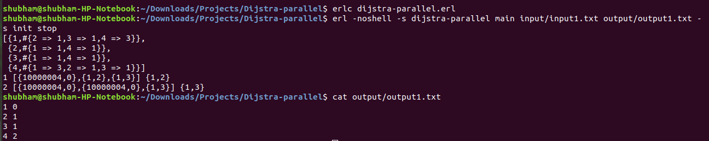

#Parallel Single Source Shortest Path (Dijkstra's Algorithm)
--------------------------------------------------------------------------------------

To implement this, I have used Parallel Dijkstra’s Algorithm. There were many difficulties I have faced while implementing it. Since, values can be assigned to a variable only time, updation was really difficult, Hence, To overcome this problem, I have used Recursion and map.

1. Read input
2. Created Graph
3. Split the Graph between the processes
4. Then, Run the below algorithm
5. Saved the output in the file.


#Parallel Dijkstra’s algorithm Approach:−
-----------------------------------------

1. Each process identifies its closest vertex to the source vertex and send it to main process.
2. Main process find the min src and update the visited list.
3. Then, it broadcasts the min vertex to all the processes.
4. Each process will update its visited list.
5. After that combine all the distance vector.

```
dijkstra(I, N, Pids, S, D, Ans) ->
	send_each_process(Pids, S, D), 
	Len = length(Pids),
	List1 = collect(1, Len),
	Min = min(List1),
	Ans1 = maps:put(element(2, Min), element(1, Min), Ans),
	dijkstra(I+1, N, Pids, element(2, Min), element(1, Min), Ans1).
```

Here, We start with (S, D) = (S, 0), where S is source vertex, then send it to all process, Now, collect the local min vertex, Now, compute global min vertex, and then recur. 

For command line arguments:

```
main(Args) ->
	Input=lists:nth(1,Args),
	Output=lists:nth(2,Args).
	
```

# Time Complexitiy: O((N^2)/P+N.(log P))
	where, N = number of vertices and P = number of processes.
The thing I have learnt from this assignment is that almost everyhting is possible using recursion :) .  
---------------------------------------------------------------------------------------------------------- 

# How to execute ?

Compilation Command: `erlc dijsktra_parallel.erl`

Execution Command: `erl -noshell -s dijsktra_parallel main input/input1.txt output/output1.txt -s init stop`



------------------------------------------------------------------------------------------------------------

